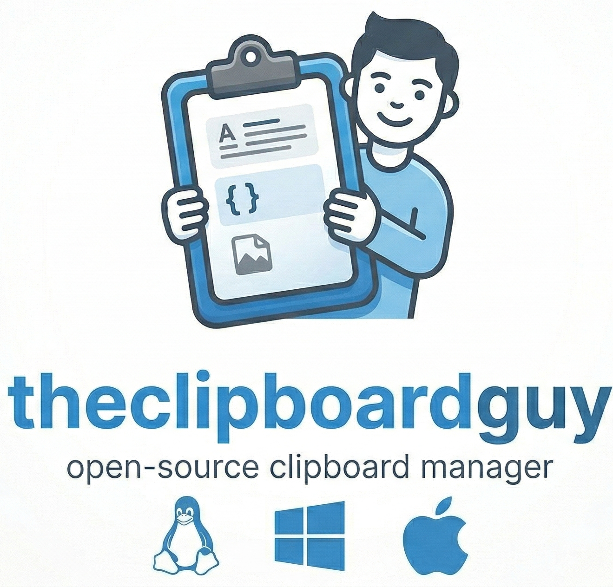
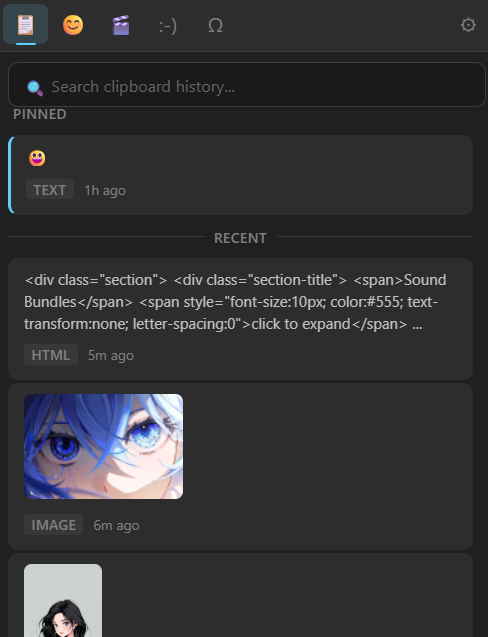

<p align="center">
  
</p>

<h1 align="center">The Clipboard Guy</h1>

<p align="center">
  A modern Windows 11-style clipboard manager built with Tauri v2.
</p>

<p align="center">
  
  
</p>

<p align="center">
  
  
  
</p>

## Features

- **Clipboard history** -- text, HTML, images, files, and RTF
- **Pin items** -- keep important clips at the top
- **Paste as text** -- strip formatting with one click
- **Emoji picker** -- browse and search 850+ emoji
- **GIF search** -- powered by KLIPY (free API)
- **Kaomoji** -- expressive text faces
- **Symbols** -- special characters and unicode symbols
- **Global shortcut** -- Configure from settings panel
- **System tray** -- runs quietly in the background
- **Dark / Light theme** -- set manually in settings
- **Search** -- instantly filter clipboard history, emoji, and more
- **Keyboard navigation** -- full keyboard support
- **Settings panel** -- configure behavior to your liking
- **SQLite persistence** -- clipboard history survives restarts

## Installation

Head to the [Releases](../../releases) page to download the latest version for your platform.

**Note:** The binaries are not code-signed. Your OS may show a warning on first launch:

- **Windows:** Click "More info" then "Run anyway" in the SmartScreen prompt
- **macOS:** Right-click the app, select "Open", then confirm
- **Linux:** Allow installation / Install anyway

**Linux Note:** Global shortcuts do not work on Wayland. Use X11 or XWayland for full functionality.

## GIF Setup

GIF search is powered by the [KLIPY API](https://klipy.com) (free, no credit card required).

1. Go to [partner.klipy.com](https://partner.klipy.com) and create an account
2. Generate an API key from the dashboard
3. Open TheClipboardGuy, go to Settings, and paste your key in the "KLIPY API Key" field

GIFs will work immediately after adding the key.

## Screenshots

<p align="center">
  
</p>

## Tech Stack

| Layer     | Technology      |
| --------- | --------------- |
| Framework | Tauri v2        |
| Backend   | Rust            |
| Frontend  | HTML / CSS / JS |
| Bundler   | Vite            |
| Database  | SQLite          |

## Development

```bash
npm install
npm run tauri dev
```

## Building

```bash
npm run tauri build
```

## License

[GPL-3.0-only](LICENSE)
